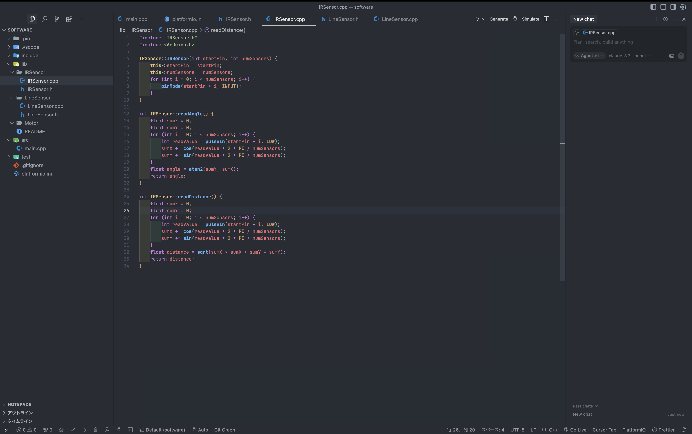

# TeacherMachine
## 概要
バイト先でのロボカップジュニアサッカー用の見本マシン

## 構成
|  | パーツ | 値段 | 個数 |
| --- | --- | --- | --- |
| マイコン | Arduino Mega Pro Mini | 2148 | 1 |
| モーター | IG22(アリエク) | 3000 | 4 |
| モータドライバ | DRV8874 | 1795 | 4 |
| IR | 自作 + 素子 | 2000 | 1 |
| ジャイロ | BNO055 | 2450 | 1 |
| ライン | 自作 + 素子 | 1500 | 1 |
| メイン基盤 | 自作 | 291 | 1 |
| モーター基盤 | 自作 | 582 | 1 |
| オムニホイール | 自作 |  | 4 |

## 開発環境

### Fusion360

機体の設計と基盤設計に使用

### Cursor

VSCodeのフォークでソフトウェア開発に使用、AIによるコード補完とチャット機能によるコード修正がとても便利。現在学生は無料でProプランを使える。

拡張機能PlatformIOを用いてArduinoフレームワークで開発

